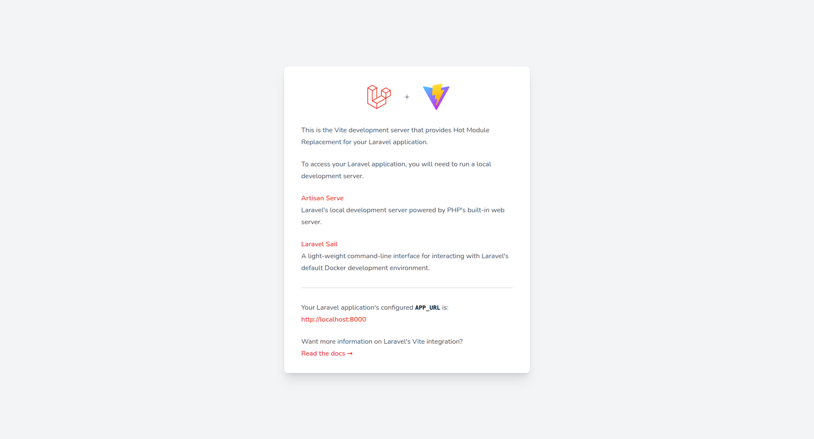

# Carta LMS - Learning Management System



## 🎓 Modern Learning Management System with AI-Powered Features

Carta LMS is a comprehensive learning management system built with Laravel, React, and Inertia.js. It features AI-powered tutoring, gamification, live classes, and a complete course management system.

## ✨ Key Features

### 🤖 AI-Powered Learning
- **AI Tutor Integration** - Get instant help from AI tutors
- **Tavus Interactive Video** - Create AI-powered video lessons with interactive avatars
- **Intelligent Progress Tracking** - AI-driven insights and recommendations

### 📚 Course Management
- **Rich Course Builder** - Videos, documents, text, images, and embeds
- **Drip Content** - Schedule content release for structured learning
- **Quizzes & Assignments** - Comprehensive assessment tools
- **Certificates** - Issue professional certificates upon completion

### 🎮 Gamification
- **Badges & Achievements** - Reward learners for milestones
- **Leaderboards** - Foster healthy competition
- **Points System** - Track and reward engagement

### 🎥 Live Learning
- **Live Classes** - Zoom integration for virtual classrooms
- **Discussion Forums** - Course-specific Q&A
- **Student Collaboration** - Peer-to-peer learning

### 💰 Monetization
- **Course Marketplace** - Sell courses with flexible pricing
- **Multiple Payment Gateways** - Stripe, PayPal, Razorpay, and more
- **Instructor Payouts** - Built-in payout management

## 🛠️ Technology Stack

- **Backend:** Laravel 11, MySQL, Sanctum
- **Frontend:** React 18, Inertia.js, TypeScript, Tailwind CSS
- **Build:** Vite
- **Testing:** Playwright

## 📦 Installation

### Prerequisites
- PHP 8.2+
- Composer
- Node.js 18+
- MySQL 8.0+

### Quick Start

```bash
# Clone repository
git clone https://github.com/yourusername/carta-lms.git
cd carta-lms

# Install dependencies
composer install
npm install

# Environment setup
cp .env.example .env
php artisan key:generate

# Database setup
php artisan migrate --seed

# Build assets
npm run build

# Start server
php artisan serve
```

Visit: `http://localhost:8000`

## 🚀 Deployment

**Live Demo:** http://165.227.113.197

See [DEPLOYMENT_COMPLETE.md](DEPLOYMENT_COMPLETE.md) for detailed deployment instructions.

## 📖 Documentation

- [Complete System Overview](COMPLETE_SYSTEM.md)
- [Backend API Documentation](BACKEND_API.md)
- [Tavus Integration Guide](TAVUS_INTEGRATION.md)
- [Landing Page Customization](LANDING_PAGE_CUSTOMIZATION.md)
- [Fixes Applied](FIXES_APPLIED.md)

## 👥 User Roles

- **Admin** - Full system access
- **Instructor** - Create and manage courses
- **Student** - Enroll in courses, track progress

## ✅ Recent Updates (December 2025)

- ✅ AI Tutor RAG system implemented
- ✅ Tavus video lesson integration
- ✅ Custom landing page with features
- ✅ Removed fake statistics
- ✅ Gamification enhancements
- ✅ Course creation fixes

## 📄 License

Proprietary software. All rights reserved.

---

**Built with ❤️ for online learning**

**Version:** 1.0.0 | **Status:** Production Ready ✅
